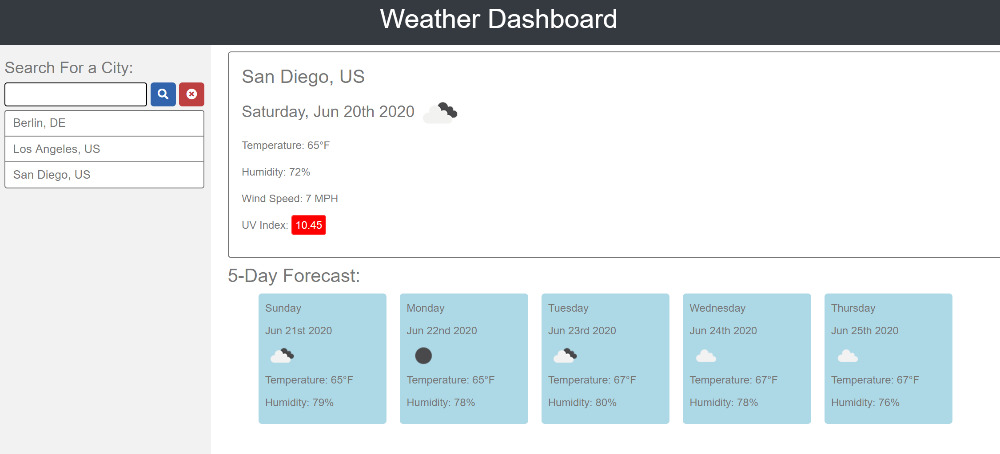

# weather-dashboard

## Purpose

Allow travelers to utilize this application to see the weather for multiple cities in order for them to plan their travel accordingly.

## Criteria for this application

GIVEN a weather dashboard with form inputs
WHEN I search for a city
THEN I am presented with current and future conditions for that city and that city is added to the search history
WHEN I view current weather conditions for that city
THEN I am presented with the city name, the date, an icon representation of weather conditions, the temperature, the humidity, the wind speed, and the UV index
WHEN I view the UV index
THEN I am presented with a color that indicates whether the conditions are favorable, moderate, or severe
WHEN I view future weather conditions for that city
THEN I am presented with a 5-day forecast that displays the date, an icon representation of weather conditions, the temperature, and the humidity
WHEN I click on a city in the search history
THEN I am again presented with current and future conditions for that city
WHEN I open the weather dashboard
THEN I am presented with the last searched city forecast

## The application and how it works.

This application was created for any person who travels constantly. When using this application, the user will type in the city they wish to look up the weather for. Upon clicking the search button, the application will populate the current weather in the main card of the application which will contain the City Name and country (in this case it will be the US), date, weather icon, temperature (in imperical units), humidity, wind speed (in imperical units) and UV index. The search button will also display a 5 day forecast below the main card. Each card will display the day, date, weather icon, temperature (in imperical units) and humidity. This application will allow user to search the weather for multiple cities, one at a time, and save the results until user selects the "clear" button.

The difficult part of this code was not realizing that the API pulls were coming back under metric, so the wind speed and temperature were coming back with errors. I was able to set my my units to imperical units and use the correct API call. Once this was fixed, the application worked as it was intended to work.

## Image of application

## Link to deployable application

[Weather Dashboard](https://goisonberry.github.io/weather-dashboard/)
